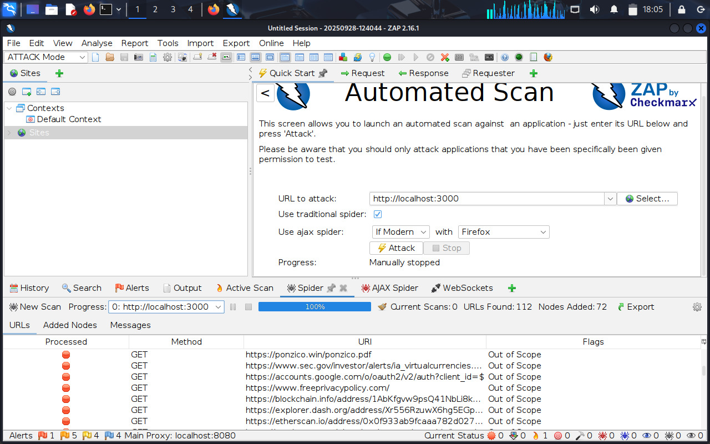
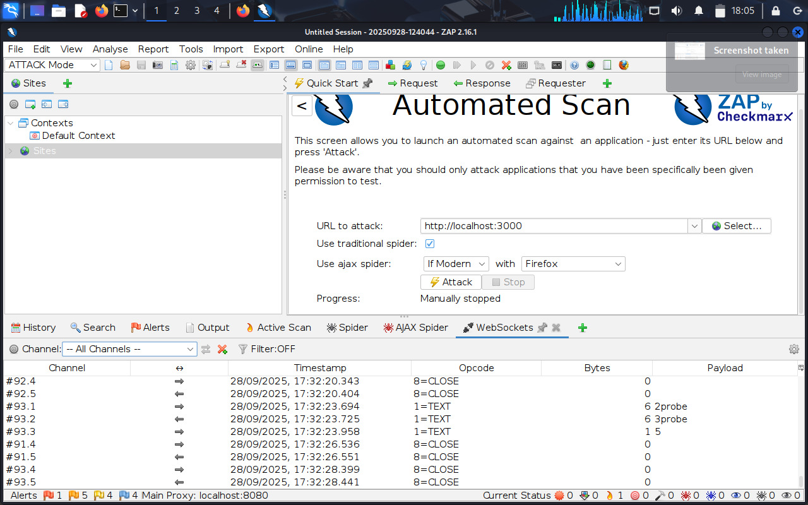
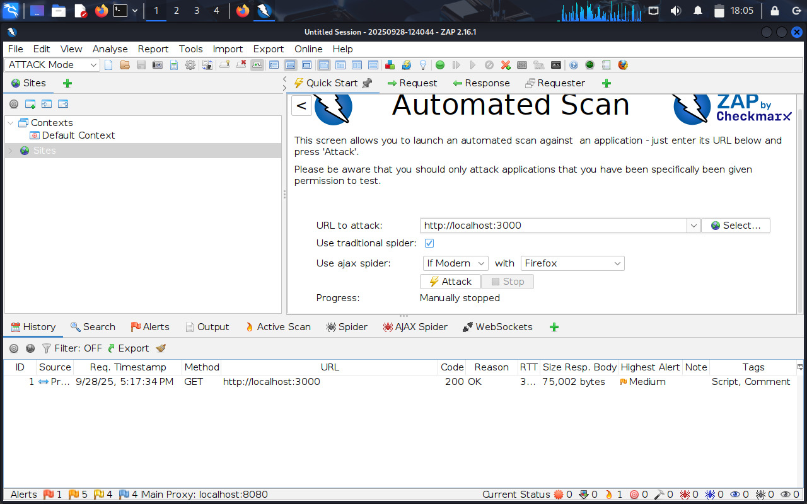
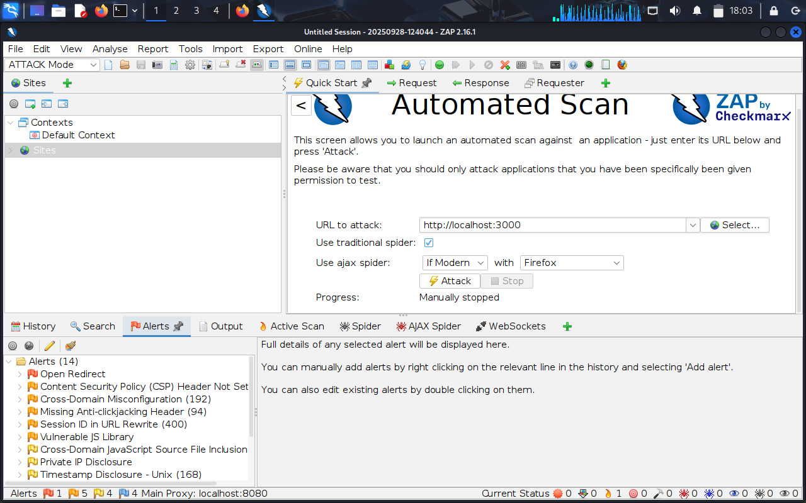

# OWASP ZAP – Juice Shop Lab

## 📌 Overview
This project demonstrates a hands-on web application vulnerability assessment using **OWASP ZAP** against the **OWASP Juice Shop** application running in Docker.  
The goal was to simulate a structured security assessment aligned with the **OWASP Top 10**.

## 🛠️ Environment
- Kali Linux (VirtualBox VM)
- Docker: OWASP Juice Shop container
- OWASP ZAP 2.16.1 (GUI mode)

## 🔍 Methodology
1. Define scope (localhost:3000, Juice Shop instance)
2. Run spider and AJAX spider for site discovery
3. Perform passive scanning
4. Perform active scanning with safe defaults (Low strength, Medium threshold)
5. Review, document, and export results

## ⚠️ Key Findings
- **Open Redirect** (High)  
- **Session ID in URL Rewrite** (Medium)  
- **CSP / Anti-clickjacking Headers Missing** (Medium)  
- **Private IP Disclosure** (Low)  
- **Outdated JS Library** (Medium)  

Each issue includes recommended mitigations such as stronger headers, avoiding sensitive data in URLs, and patching dependencies.

## 📊 Deliverables
- [Full HTML Report](docs/owasp-zap-report.html)  
- [Screenshots](docs/screenshots/) – ZAP configuration, scan results, sample findings

## 🧑‍💻 Skills Demonstrated
- Web Application Penetration Testing  
- Vulnerability Scanning with ZAP  
- OWASP Top 10 Awareness  
- Report Writing and Documentation

---

## References
- [OWASP ZAP](https://www.zaproxy.org/)  
- [OWASP Juice Shop](https://owasp.org/www-project-juice-shop/) 

## Screenshots

### Juice Shop Homepage

### Spider

### Ajax Spider

### Active Scan

### WebSockets

### History

### Alerts

## 📊 Full ZAP Report
You can view the complete detailed OWASP ZAP scan report here:  
👉 [OWASP ZAP Juice Shop Report](https://numanshaik-security.github.io/owasp-zap-juice-shop-lab/owasp-zap-report.html)

